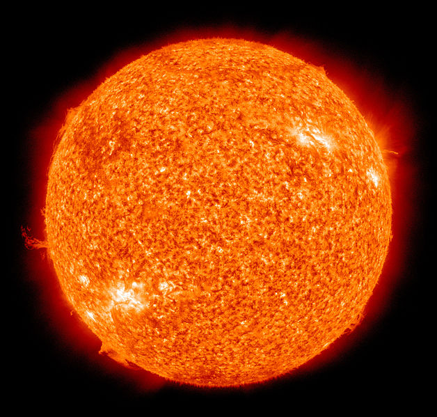
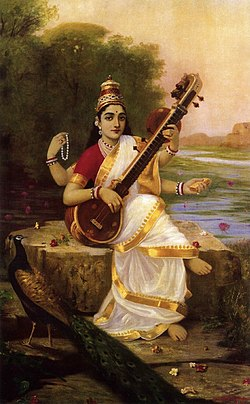

## Epistemological essence

- The classical hindu view is that the world is permeated with consciousness.
- Beyond this, one [vaidika view](https://youtu.be/DUsZ_5A7-Ho?list=PLhPjckGlZ7rQFXvhumWnIctUgARdPYayL&t=228) \[[YT](https://youtu.be/DUsZ_5A7-Ho?list=PLhPjckGlZ7rQFXvhumWnIctUgARdPYayL&t=228)\] was that the devatA-s are conscious and willful entities attached to every single living or non-living substance. Prominently, they're in the natural objects/ forces/ motivations they personify.
- In one point of view, the dEvatAs are actually concepts which exist in the form of mantras and even entire texts - see citations in [mantra page](../../../self-cultivation/mantra-yantra/)-s).
  - Consonance with modern views - Vishwa Adluri - "Rama is in the rAmAyaNa" [YT](https://twitter.com/agnimaan/status/1047594919085264896), [AR](https://archive.org/details/hindu-sanskrit-lectures/20180929-0001-ThinkOlio+_+Time%2C+Desire+and+Action+-+Ramayana+and+The+Cosmic+Game.mp3).
  - "रसो वै सः" इति श्रुतिः।
- The **deities as entities of wonder:** kRShNa says in the exceptionally brilliant chapter 10 bhagavad-gItA, after identifying himself with a long series of awesome things (such as "दण्डो दमयतामस्मि नीतिरस्मि जिगीषताम्") : "यद्यद्विभूतिमत्सत्त्वं श्रीमदूर्जितमेव वा । तत्तदेवावगच्छ त्वं मम तेजोंऽशसम्भवम् ॥ ४१ ॥" - "All that is endowed with glory, grace, grandeur, has sprung from a mere flare of my radiance" (Dr. G L Krishna [here](http://www.sandeepweb.com/the-bhagavad-gita-before-the-battle/)). This is concordant with the hindu notion of divinity.
    - "Āścaryavat paśyati kaścid enam, āścaryavad vadati tathaiva cānyaḥ | Āścaryavac cainam anyaḥ śṛṇoti, śrutvāpy enaṃ veda na caiva kaścit ||" (BG)
    - To paraphrase GL kRShNa: The adoration of awesomeness includes adoration of glorious characters in our legends, the celebration of natural geography (the great rivers, the great mountains, etc. as centres of pilgrimage) and the adoration of sages (from Vyasa-Vishwamitra to Ramana-Ramakrishna).
  - "The deities of heaven and earth that appear in the ancient texts and also the spirits enshrined in the shrines; furthermore, among all kinds of beings – including not only human beings but also such objects as birds, beasts, trees, grass, seas, mountains, and so forth"
- We emphasize that to a practicing hindu, they are not remotely abstract entities like Jupiter, Mars, Neptune, Juno are to (sadly) Christianized Italians; rather they are alive and immediate in the artistic experience that is the hindu way of thought. One propitiates them regularly with various rituals (In fact, I am more observant than most) as if they were wilful entities, and questions about their imaginary nature never enter my mind when involved with hindu rituals. It is a primeval way of looking at nature and life. IshAna still lives in our rage, Indra in our stength, prithivI/ Earth in our body, herbs in our hair, sarasvatI on the tip of my tongue, agni in my speech and so on. (A lament on the fools that chose to leave this for the monotony and paleness of Abrahamisms [is here](http://agnimaan.wordpress.com/2015/01/13/the-fools-that-converted/).)

### Examples elsewhere
- [Sallustius's views](../../../../paganology/mediterranian/philosophy/platonism/sallustius/) are highly valuable.
– any being whatsoever which possesses some eminent quality out of the ordinary, and is awe-inspiring, is called kami. (Eminence here does not refer simply to superiority in nobility, goodness, or meritoriousness. Evil or queer things, if they are extraordinarily awe-inspiring, are also called kami.) (Norinaga, quoted in Matsumoto 1970:84)" \[- Wonderment and awe: way of kami [here](http://refractory.unimelb.edu.au/2004/02/03/wonderment-and-awe-the-way-of-the-kami-lucy-wright/)\]
- The high priest of Ásatrúarfélagið, the norse temple : “I don’t believe anyone believes in a one-eyed man who is riding about on a horse with eight feet,” Hilmar Örn Hilmarsson, told Reuters. “We see the stories as poetic metaphors and a manifestation of the forces of nature and human psychology.” ... The priest said the gods are viewed as mystical and symbolic. Most modern worshipers don’t consider them to be living beings that are capable of flying down from the clouds. ... The Asatru religion might describe itself as poetic--but if some Christians, especially those in the Western hemisphere, were to take a literal look at the new altar to pagan gods they might consider it satanic. ([DailyBeast](http://www.thedailybeast.com/articles/2015/02/05/why-iceland-is-building-a-temple-to-its-pagan-gods.html))

## Major deities

- 8 vasu-s
- 12 Aditya-s
    - dhātā aryamā mitra varuṇa aṁśuman bhaga indra vivasvān pūṣā parjanya tvaṣṭa viṣṇu
- 11 rudra-s
- 7 marut-s
- 2 ashvin-s

### Correspondance with natural objects

- sun, moon, earth, air, planets, stars
- Dawn.
- Cloud, thunder and rain
- Trees
    - \[[IMG](https://imgur.com/p3G5RSo)\]
    - Flowers
        - padma as the abode of lakShmI at dawn, is not plucked.
- Forests
    - (Ref shAkuntala and bhavabhUti for forest deity)
- Mountains
    - himAlaya
- Water bodies
    - Rivers
    - Seas
    - lakes
- City deities
    - lankA in rAmAyaNa
    - ayodhyA (in some kAvya)

## Deification and expansion
Also see notes on absorption of foreign deities at the [deity competition page](../hierarchy/competition/).

### Transplantation into new shrines
- Trinidad and Tobago
    - "Yet it was in 1995, during the celebration of Trinidad and Tobago’s 150th Anniversary of Indian Arrival Day that interested persons in India collected water and dust from two thousand sacred pilgrimage places along the Ganges and this was then brought to Trinidad in two urns specially made of several metals. The dust of nine sacred locations in Trinidad was also added and then, using a machine, a hole was pierced deep into a large slab of stone where the ancient design was interred. Then all was buried at a place (called the prayaag) where two rivers converged to form one, thereby consecrating the river. Thus was teerath created here, making the river officially and spiritually Ganga for local Hindus to come and worship at." [Triniview](http://www.triniview.com/blog/?p=575).
- Mauritius
    - Mauritius gangA and mauritiuseshvara.

### Apotheosis and divine incarnation

- In the hindu traditions raising humans to a divine level is very easy and common.
- Recent ancestors and sages are treated as de-facto deva-s with supernatural powers. brAhmaNa-s are described as bhU-sura-s; cows and certain plants are venerated.
- Some bhakta-s are said to be raised to the level of protector deities \[eg nandin, chaNdesha, bhR^i~NgiriTi, kubera - [TW](https://twitter.com/blog_supplement/status/841857310012112896)\]

#### Examples elsewhere
- Deified heroes among the Chinese \[[WP](https://agnimaan.wordpress.com/2016/03/26/guan-yu-pagan-reverence-of-anything-awesome/?fb_action_ids=10153616560317989&fb_action_types=news.publishes&fb_source=og_snowlift_photo_robotext)\]

## Other near-human near-god beings
### Among hindu-s

#### Superhuman sky-travellers
- siddha-s, chAraNa-s, vidyAdhara-s
- gandharva-s
- yakSha-s
- asura-s and rAxasa-s (../also see [non-evil page](non-evil/))

#### vAnara-s and the like
- Possible inspiration from other coexisting homo-species
    - Neanderthals and trolls and giants in Europe - [NA16](https://cogniarchae.wordpress.com/2016/12/01/neanderthals-in-ancient-mythology/).

### Among non-hindu-s

- Titans
    - Mostly imprisoned in Tartarus, but some were revered "Saturn is identified with Kronos, a Titan, and yet has an important cult in Rome. Rhea, when she is identified with Kybele, also has important cultus in the Hellenistic era."
- Giants and Trolls
- Fairies
- Elves
- Dwarves
